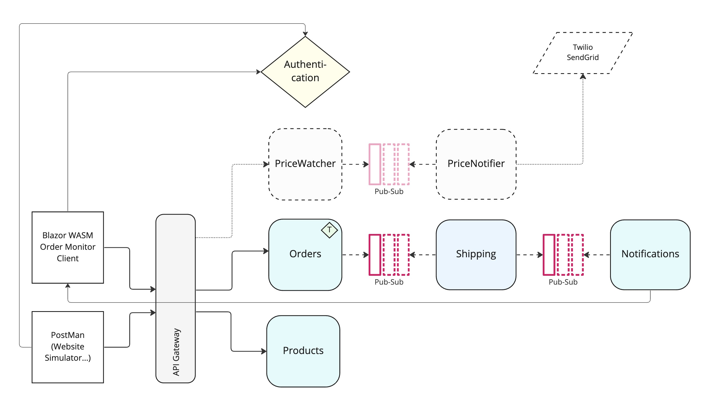

# Cloud-Native Sample Application

This repository contains a sample application that serves as a demonstration for building and automating a polyglot cloud-native application. The application is designed to showcase proven practices for developing and deploying cloud-native software using a combination of programming languages and tools:

* Programming Languages
  * .NET (C#)
  * Go

* Tools
  * Docker
  * Docker Compose
  * Dapr (Distributed Application Runtime)
  * Kubernetes (when running in Azure)
  * HashiCorp Terraform
  * GitHub Actions
  * Makefiles

[TBD: Some general introduction.]

## Builds

      

## License

[](https://choosealicense.com/licenses/mit/)

## Application Diagram



## Observability Stack

For the scope of this application, we've choosen the following technologies to address observability concerns:

* Metrics: [Prometheus](https://prometheus.io)
* Distributed Tracing: [Zipkin](https://zipkin.io)
* Logs: [Grafana Loki](https://grafana.com/oss/loki/)
* Visualization: [Grafana](https://grafana.com/grafana/)

## Local execution

We decided to go with Docker Compose for local development story. As an alternative, you can also setup a local Kubernetes cluster (KIND / minikube /...).

### URLs and demo credentials

When running the application in Docker Compose, you'll end up with the following ports forwarded on your host machine:

* Frontend: Order Monitor Client (OMC)
  * [http://localhost:5000](http://localhost:5000)
* Authentication Service (IdSrv)
  * [http://localhost:5009](http://localhost:5009)
  * Credentials (`bob:bob`)
* Gateway
  * Root: [http://localhost:5000](http://localhost:5000) -> Serves the Frontend (OMC)
  * Swagger (Products Service): [http://localhost:5000/products/swagger/](http://localhost:5000/products/swagger/)
  * Swagger (Orders Service): [http://localhost:5000/orders/swagger/](http://localhost:5000/orders/swagger/)
* Grafana
  * [http://localhost:3000](http://localhost:3000)
  * Username: `admin`
  * Password: `admin`
* Prometheus
  * [http://localhost:9090](http://localhost:9090)
* Alertmanager
  * [http://localhost:9093](http://localhost:9093)
* Zipkin
  * [http://localhost:9411](http://localhost:9411)
* RabbitMQ
  * [http://localhost:15672](http://localhost:15672)
  * Username: `guest`
  * Password: `guest`

**Use [http://localhost:5000](http://localhost:5000) to access the OMC proxied through the gateway locally.**

Note: *Dapr-dashboard does currently not work in Docker compose mode*

### Necessary plugins for local execution

We use Loki as log aggregation system. In the local environment, we leverage lokis docker plugin to ship all logs from containers output streams (`STDOUT` and `STDERR`) to Loki.

```bash
# Install Docker Plugin for Loki
docker plugin install grafana/loki-docker-driver:latest --alias loki --grant-all-permissions
```

### Local Environment Execution using the Makefile

Find the `Makefile` in the root of the repository. Use it to perform common tasks as shown below:

```bash

# Install loki plugin locally
make init

# Start the sample locally (in docker)
make start 

# Quickstart (no image build) the sample locally (in docker)
make quickstart

# get logs
make logs

# stop the sample
make stop

# clean-up the local docker environment
## stops everything
## removes images
## removes volumes
## removes orphan containers
## removes custom docker network
make cleanup
```

### Local Environment Execution using the docker-compose CLI

```bash
# Build Container images
docker-compose build

# Cleanup previously started instances
docker-compose rm -f

# Start cloud-native sample application (detached)
docker-compose up -d
# Start cloud-native sample application (blocking)
docker-compose up

# To stream logs to the terminal use
docker-compose logs
```

#### Cleanup environment

```bash
# remove running containers
docker-compose rm -f

# remove custom Docker network
docker network rm cloud-native -f

# uninstall Loki Plugin
docker plugin rm loki -f
```

### Local Environment Execution using the `cn-sample` CLI

You can also automate the local environment execution using the `cn-sample` CLI (see `/tools/<your_platform>`).

Consider adding `cn-sample` to your path before invoking it.

The `sn-sample` CLI is designed to be invoked from the root directory of this repository.

## Azure environment

For demonstration purposes, we added all necessary Infrastructure-as-Code (IaC) (using [HashiCorp Terraform](https://terraform.io)) and corresponding [GitHub Actions](./github/workflows) to deploy and run the application in Microsoft Azure leveraging Azure Kubernetes Service (AKS).

When running in the cloud, one must always decide on **Run vs. Rent**. For example: Instead of running a message broker like [RabbitMQ](https://www.rabbitmq.com/) on your own (yes, running something in a container means you run it on your own, because you've to maintain and troubleshoot it), and renting a message broker like [Azure Service Bus](https://learn.microsoft.com/en-us/azure/service-bus-messaging/service-bus-messaging-overview).

Again, you can find corresponding GitHub Actions in the repository to switch between **Run** and **Rent** in Azure. Those GitHub Actions must be triggered manually.
