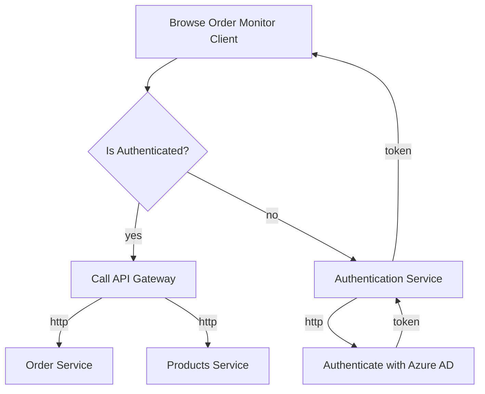
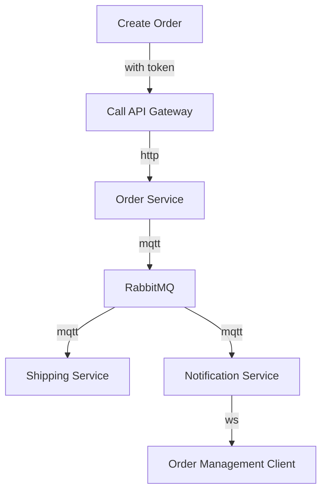

# Cloud-Native Sample Application (Work-in-Progress)

*Note*: This is heavy work in progress - do not rely on the things you see here, yet. Please ask us if you want to adapt things in your code / environment.

[TBD: Some general introduction.]

## Application Diagram

### Architecture overview


### Order Monitor Client



### Create an order with Postman



## Docker Compose

We decided to go with Docker Compose for local development story. As an alternative, you can also setup a local Kubernetes cluster (KIND / minikube /...).

### URLs and demo credentials

When running the application in Docker Compose, you'll end up with the following ports forwarded on your host machine:

* Frontend (Order Monitor Client)
  * [http://localhost:5005](http://localhost:5005)
* Authentication Service (IdSrv)
  * [http://localhost:5009](http://localhost:5009)
* Gateway
  * Root: [http://localhost:5000](http://localhost:5000)
  * Swagger (Products Service): [http://localhost:5000/products/swagger/](http://localhost:5000/products/swagger/)
  * Swagger (Orders Service): [http://localhost:5000/orders/swagger/](http://localhost:5000/orders/swagger/)
* Grafana
  * [http://localhost:3000](http://localhost:3000)
  * Username: `admin`
  * Password: `admin`
* Zipkin
  * [http://localhost:9411](http://localhost:9411)
* RabbitMQ
  * [http://localhost:15672](http://localhost:15672)
  * Username: `guest`
  * Password: `guest`

**Use [http://localhost:5000](http://localhost:5000) to access the OMC proxied through the gateway locally.**

Note: *Dapr-dashboard does currently not work in Docker compose mode*

### Necessary plugin installation for Docker Compose

```bash
# Install Docker Plugin for Loki
docker plugin install grafana/loki-docker-driver:latest --alias loki --grant-all-permissions
```

### Local Environment

Find the `Makefile` in the root of the repository. Use it to perform common tasks as shown below:

```bash

# Install loki plugin locally
make init

# Start the sample locally (in docker)
make start 

# Quickstart (no image build) the sample locally (in docker)
make quickstart

# get logs
make logs

# stop the sample
make stop

# clean-up the local docker environment
## stops everything
## removes images
## removes volumes
## removes orphan containers
## removes custom docker network
make cleanup
```

### Common Docker-Compose commands

```bash
# Build Container images
docker-compose build

# Cleanup previously started instances
docker-compose rm -f

# Start cloud-native sample application (detached)
docker-compose up -d
# Start cloud-native sample application (blocking)
docker-compose up

# To stream logs to the terminal use
docker-compose logs
```

### Cleanup environment

```bash
# remove running containers
docker-compose rm -f

# remove custom Docker network
docker network rm cloud-native -f

# uninstall Loki Plugin
docker plugin rm loki -f
```

## Azure environment

### Azure Service Bus

When using Azure Service Bus as a message broker, make sure to have at least a **Standard tier** in place which is required to use *Topics* (Basic will not work).Please add your own SAS connection string in the .yaml file for Azure Service Bus.

## Tools

### Load-Testing with Hey

[Hey](https://github.com/rakyll/hey) is a portable load tester

```bash
brew install hey

hey -c 1 -n 1000 http://localhost:5000/products
```
